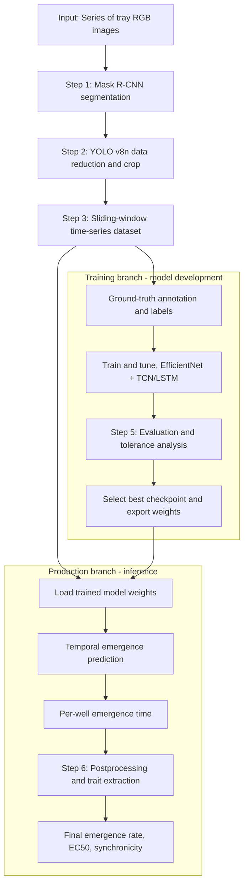

# SPROUT - AI-based Seedling emergence PRedictiOn and trait extraction Using RGB Time-series

SPROUT is a modular RGB time-series phenotyping pipeline for automatic seedling emergence detection and trait extraction. Based on the manuscript, the method combines tray-level instance segmentation, YOLO-guided data reduction, temporal deep learning, and emergence-curve analysis to derive biologically meaningful traits:

- Final emergence rate
- EC50 (time lag)
- Emergence synchronicity (curve slope)

The repository contains both production-ready inference code and reproducibility/fine-tuning notebooks used during model development.

---

## Paper-to-code mapping

The manuscript describes a six-step analytical workflow. In this repository it maps as follows:

| Research step (paper) | Practical implementation in this repo |
|---|---|
| 1. Well segmentation (Mask R-CNN) | `pipeline/1_segmentation/1-1_segment_boxes.py` and `src/emergence/stages/segmentation.py` |
| 2. Data reduction via detection + crop (YOLO) | `pipeline/2_cropping/2-1_crop_segments.py` and `src/emergence/stages/cropping.py` |
| 3. Time-series reshaping/windowing | `pipeline/3_timeseries_dataset/3-1_timeseries_dataset.py` and `src/emergence/stages/timeseries_dataset.py` |
| 4. Temporal emergence prediction (EfficientNet + TCN/LSTM variants) | `pipeline/4_emergence_predictions/4-1_emergence_predictions.py` and `src/emergence/stages/emergence_predictions.py` |
| 5. Prediction evaluation and tolerance checks | `src_train/5-evaluation/` and `src_finetuning/5-evaluation/` notebooks/scripts |
| 6. Curve-level post-processing and trait extraction | `pipeline/5_prediction_postprocessing/5-1_postprocess_emergence_predictions.py` and `src/emergence/stages/emergence_prediction_postprocessing.py` |

---

## End-to-end pipeline overview

Shared pre-processing is identical for both branches (steps 1-3). After dataset creation, the workflow splits into a production branch and a training branch.



---


## Installation

Python 3.11 is required.

```bash
uv sync
```

GPU is strongly recommended for Detectron2, YOLO, and TensorFlow model inference.

---

## Configuration

All stages read paths from `config/paths.toml`.

Minimum required fields:

```toml
[paths]
project_root = "/absolute/path/to/sprout-emergence-prediction"
project_name = "my_experiment"
time_steps = 3
data_range = 9
```

You can also override the config location via environment variable:

```bash
export EMERGENCE_CONFIG=/absolute/path/to/config/paths.toml
```

Object-detection and crop-window tuning (including the default 75 px window) is currently defined in stage code:

- `src/emergence/stages/cropping.py`
    - `CROP_SIZE = (75, 75)` controls crop window size in pixels.
    - `BB_THRESHOLD = 55` controls the max side length for a "small" candidate box.
    - `YOLO_CONF = 0.6` controls YOLO confidence threshold.
    - `YOLO_MAX_DET = 5` controls max detections per image.
- `src/emergence/stages/timeseries_dataset.py`
    - `IMG_SIZE = 75` should stay aligned with the crop size.

Note: model and dataset folders in `paths.toml` can be customized. The defaults may reference paths that are not versioned in this repository.

---

## Running the production pipeline

Use root entrypoints (recommended):

```bash
uv run create_dataset.py
uv run emergence_prediction.py
uv run postprocess_emergence_predictions.py
```

Or run stage wrappers individually:

```bash
uv run pipeline/1_segmentation/1-1_segment_boxes.py
uv run pipeline/2_cropping/2-1_crop_segments.py
uv run pipeline/3_timeseries_dataset/3-1_timeseries_dataset.py
uv run pipeline/4_emergence_predictions/4-1_emergence_predictions.py
uv run pipeline/5_prediction_postprocessing/5-1_postprocess_emergence_predictions.py
```

---

## Main outputs

Stage 4 prediction outputs:

- `predictions_model_<time_steps>-<data_range>.csv/.xlsx`
- `first_germination_model_<time_steps>-<data_range>.csv/.xlsx`

Stage 5 postprocessed outputs:

- `predictions_model_<time_steps>-<data_range>_with_tolerance.csv/.xlsx`
- `first_germination_model_<time_steps>-<data_range>_with_tolerance.csv/.xlsx`

Postprocessing adds directional proxy columns:

- `prediction_-2`, `prediction_-1`, `prediction_+1`, `prediction_+2`

---

## About training and fine-tuning resources

- `src_train/` documents full model training and evaluation workflows.
- `src_finetuning/` provides adaptation scripts/notebooks for new datasets.
- Production inference code lives in `src/emergence/` and `pipeline/`.

---

## Paper

This repository supports the SPROUT manuscript currently under review in Computers and Electronics in Agriculture.

---

## Citation

**Currently in review**

If you use SPROUT, please cite:

De Diego, N., Klimes, P., Voral, V., Gomez Mansur, N. M., Vasak, J., Kholova, J., Cavar Zeljkovic, S., Rozehnalova, M., Spichal, L., and Masner, J. (in review). SPROUT: AI-based Seedling emergence PRedictiOn and trait extraction Using RGB Time-series. Computers and Electronics in Agriculture. Manuscript COMPAG-D-26-02593.

---

## License

License will be finalized upon paper acceptance.
